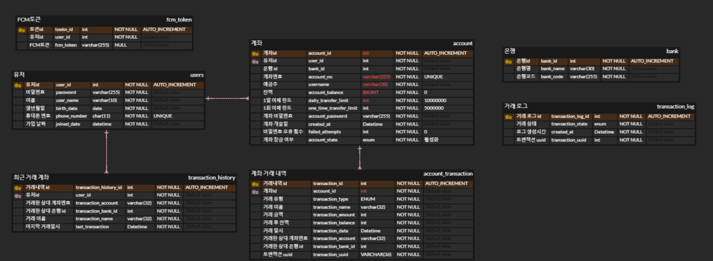

# BF(BarrierFree)

## 1️⃣ 서비스 소개

### 개요

- 시각 장애인을 위한 간편뱅킹 서비스 
- 서비스명 : **BF(BarrierFree)**

### 타겟층 🎯

- 시각 장애인🫂
- 저시력자👳🧓

### UCC 📽️

### Presentation 📕

 

## 2️⃣기획 배경

### 배경

- **변화하는 시대에 맞춰 발전하는 폰뱅킹, 눈이 안좋아 사용하기 불편하다 ..**😢 좋은 방법이 있을까요❓
- **은행 비밀번호를 입력하려면 도우미가 필요하다. 개인정보 괜찮은 건가?**😨 

👉 그래서 **시각 장애인에게 최적화된 폰뱅킹 환경 제공! ** BF**가 탄생했습니다! 💙

### 목적 ✅

시각 장애인의의 프라이버시를 보완한 간편 뱅킹 서비스를 만들자‼️

 

## 3️⃣기능 소개

### 📌드로잉 기능
- 송금 시 계좌, 금액, 비밀번호 입력에서 키보드가 아닌 드로잉 모달 제공
- X 드로잉 시 숫자 지우기, V 드로잉 시 드로잉 완료
- 숫자 입력 시 음성 피드백 제공
- 숫자 입력을 완료한 경우 확인 페이지 제공하여 재확인
---

### 📌신분증 인식 - OCR 기능
- 
---

### 📌시각장애인을 위한 진동 / 음성 피드백
- 시각장애인이 주로 사용하는 접근성 서비스의 피드백 차용
- 송금 완료, 비밀번호 확인, 결제 확인 등의 주요 알림의 진동 피드백 패턴을 통한 커스텀
- 모든 화면에서 텍스트 및 대체 텍스트로 구성되어 알기 쉬운 음성 피드백 제공
---

### 📌직관적 UI / UX
- 휴대폰을 활용한 직관적 UI 구성
- 모든 아이콘, 로고, 이미지 대체 텍스트화 

## 4️⃣기술 스택
### BackEnd
- Java
- Python
- Spring Boot
- Spring JPA
- Flask
- MySQL
- Redis
- Web Socket
- Amazon S3
- Firebase

### Frontend
- VisualStudioCode / Android Studio
- Node.js
- NPM
- TypeScript
- React Native
- React
- Axios
- Zustand

### Infrastructure
- Gitlab Actions
- Docker
- Amazon EC2

## 5️⃣핵심 기술
### ✔️OCR
1. 객체 인식
2. OCR
- OCR을 위한 ec2 서버 배포
- Flask 서버를 통해 image를 POST 요청으로 보내면 Paddle OCR을 사용하여 이미지에서 텍스트 정보 추출
- Python 정규식을 활용하여 이름, 주민번호 앞자리/뒷자리, 발급일자 검증 및 정확도 산출
3. 진위여부 확인
- 정확도 0.95이상일 경우 API를 통해 주민등록증 진위여부 확인

### ✔️MessageQue

### ✔️Viberation & TTS customizing
1. 진동 모듈 커스텀
- 진동의 세기 및 리듬으로 사용자에게 정보 전달
    - 한번 탭 :약한 진동 한번
    - 두번 탭 : 약한 진동 두번
    - 성공 : _ -
    - 실패 : _ _ —
    - 경고 : — — —
    - 드로잉 중 : 심장 박동 느낌
    - 로딩 중 : 도로록 도로록
    - 송금/결제 완료 : 게이지가가 차는 느낌
 

 

## 6️⃣서비스 아키텍처

 

## 7️⃣프로젝트 산출물
### 📌 ERD

---

### 📌 Flow chart

---

### 📌Figma

---

### 📌 API 문서
[주민등록증 진위 여부 API](https://apick.app/dev_guide/identi_card1)
